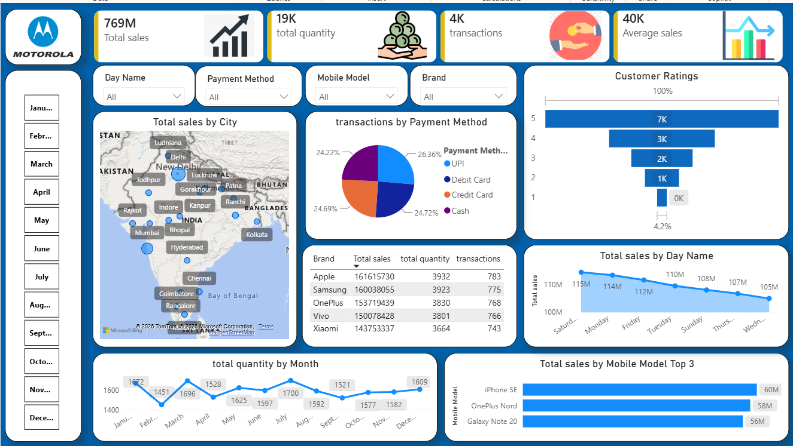
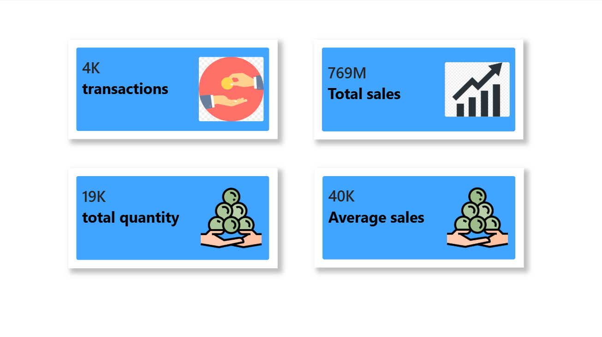
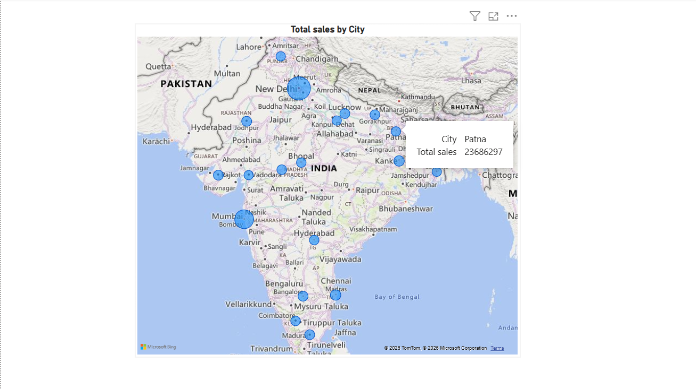
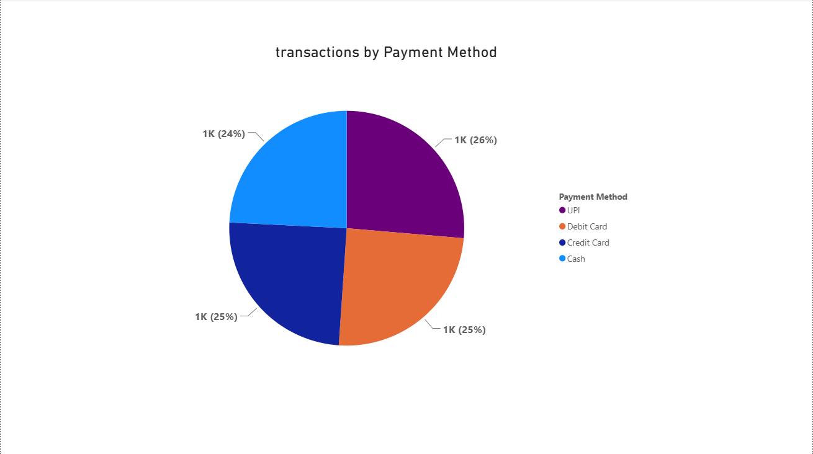
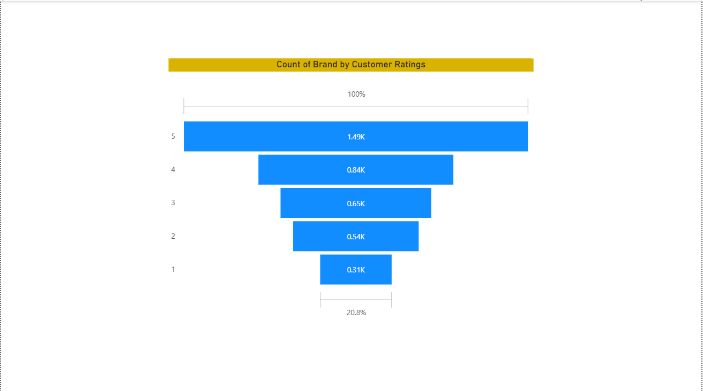
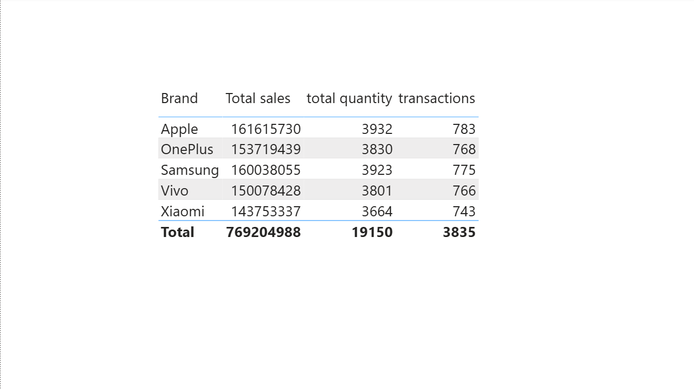
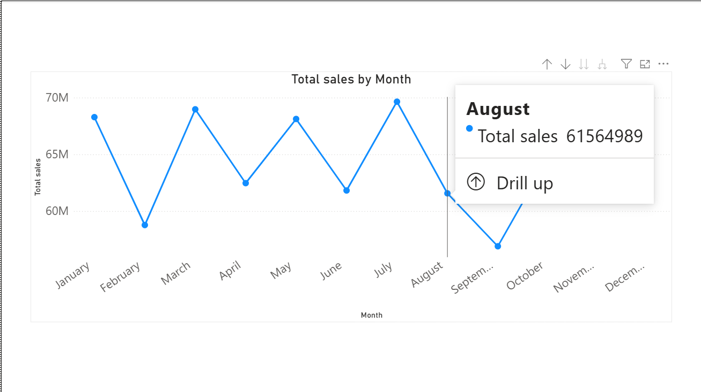
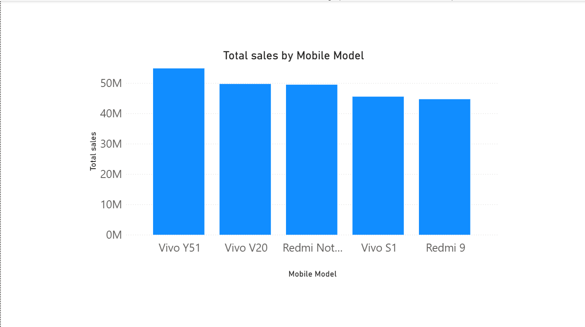

# 📱 Power BI Mobile Sales Dashboard


---

## 📌 Project Overview

This project is an interactive **Power BI dashboard** developed to analyze mobile phone sales data. It provides meaningful business insights into sales performance, customer behavior, payment methods, product performance, and regional sales trends.

The dashboard helps businesses monitor key performance indicators (KPIs), identify sales trends, compare brand performance, and make data-driven decisions using interactive visualizations.

---

## 📷 Dashboard Screenshots

### Dashboard Overview



---

### KPI Summary



---

### Sales by City



---

### Payment Method Analysis



---

### Customer Ratings



---

### Brand Performance



---

### Sales Trend



---

### Top Selling Mobile Models



---

# 📥 Project Files

| File | Description |
|------|-------------|
| 📊 [Power BI Dashboard](dashboard/Mobile_Sales_Dashboard.pbix) | Power BI Dashboard File |
| 📁 [Dataset](dataset/Mobile_Sales_Data.xlsx) | Excel Dataset |
| 📄 [Project Documentation](documentation/Project_Report.docx) | Project Documentation |

---

# 🎯 Business Objectives

- Analyze overall mobile sales performance.
- Compare sales across different mobile brands.
- Identify top-selling mobile models.
- Understand customer payment preferences.
- Evaluate customer satisfaction through ratings.
- Track monthly and daily sales trends.

---

# 📈 Key Performance Indicators (KPIs)

| KPI | Value |
|------|------:|
| Total Sales | **769M** |
| Total Quantity Sold | **19K** |
| Total Transactions | **4K** |
| Average Sales | **40K** |

---

# 📊 Dashboard Features

- 📍 Sales Analysis by City (Map)
- 💳 Payment Method Distribution
- ⭐ Customer Rating Analysis
- 📅 Sales Trend by Day
- 📆 Monthly Quantity Trend
- 📱 Top Selling Mobile Models
- 🏷 Brand Performance Comparison
- 🔍 Interactive Filters (Month, Day, Brand, Model, Payment Method)

---

# 📊 Dashboard Insights

- Apple generated the highest total sales.
- iPhone SE was the top-selling mobile model.
- Saturday recorded the highest sales.
- Most customers rated products between **4 and 5 stars**.
- UPI, Debit Card, Credit Card, and Cash contributed almost equally to total sales.

---

# 🛠 Tools & Technologies

- Microsoft Power BI
- Microsoft Excel
- Power Query
- DAX (Data Analysis Expressions)

---

# 📂 Project Structure

```text
powerbi-mobile-sales-dashboard
│
├── dashboard
│   └── Mobile_Sales_Dashboard.pbix
│
├── dataset
│   └── Mobile_Sales_Data.xlsx
│
├── documentation
│   └── Project_Report.docx
│
├── screenshots
│   └── dashboard-overview.png
│
└── README.md
```

---

# 🚀 How to Use

1. Clone or download this repository.
2. Open **Mobile_Sales_Dashboard.pbix** using **Microsoft Power BI Desktop**.
3. If required, refresh the dataset.
4. Explore the dashboard using the interactive filters.

---

# 💡 Skills Demonstrated

- Data Cleaning
- Data Transformation
- Data Visualization
- Dashboard Development
- Business Intelligence
- KPI Reporting
- Power Query
- DAX
- Sales Analytics

---

# 📌 Dataset

The dataset includes information related to:

- Transaction ID
- Date
- City
- Mobile Brand
- Mobile Model
- Quantity Sold
- Sales Amount
- Customer Rating
- Payment Method

> **Note:** This project uses a publicly available dataset downloaded from the internet for learning and portfolio purposes.

---

# 🔮 Future Improvements

- Add Profit Analysis
- Add Year-over-Year (YoY) Sales Comparison
- Create Customer Segmentation
- Implement Sales Forecasting
- Publish Dashboard to Power BI Service

---

# 👩‍💻 Author

**Aachal Bhise**

Aspiring Data Analyst

- GitHub: https://github.com/aachalb26

---

## ⭐ If you found this project helpful, please consider giving it a Star.nsider giving it a Star!
